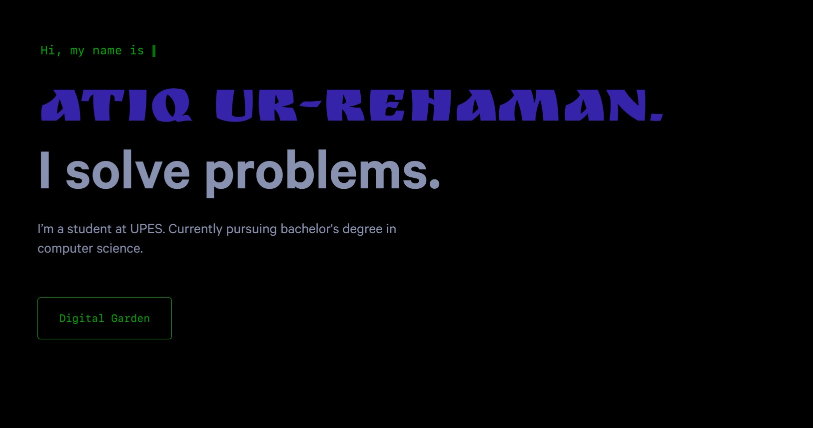

<div align="center">
  
</div>
<h1 align="center">
  Adam Al-Rahman
</h1>
<p align="center">The Portfolio Website.</p>
<p align="center">
  This project is the portfolio of mine built with <a href="https://www.gatsbyjs.org/" target="_blank">Gatsby</a> and hosted with <a href="https://www.netlify.com/" target="_blank">Netlify</a>
</p>
<p align="center">
  <a href="https://app.netlify.com/sites/atiq-ur-rehaman/deploys" target="_blank">
    
  </a>
</p>




## Credit

This is cloned from a open source by [Brittany Chiang](https://github.com/bchiang7/v4) | Created by Adam Al-Rahman.

## How this is done using gatsby

### Install gatsby

First we need to install gatsby. Assuming that you install node.

```sh
npm install -g gatsby
```

### Creating the project locally

Using below command to create the gatsby starter project with Chiang's V4.

```sh
gatsby new project-name https://github.com/bchiang7/v4
```

once it done your are ready to run it locally by

First time : `gatsby develop`

Second onwards :  `npm run develop`

You can see your site at : `http://localhost:8000`


## 🎨 Color Reference [in HEX]

| Color          | Brittany Chiang                                                    | Adam Al-Rahman |
| -------------- | ------------------------------------------------------------------ | -------------- |
| Navy           |  `#0a192f` | `#000`         |
| Light Navy     |  `#112240` | `#00aa0025`    |
| Lightest Navy  |  `#233554` | `#233554`      |
| Slate          |  `#8892b0` | `#8892b0`      |
| Light Slate    |  `#a8b2d1` | `#a8b2d1`      |
| Lightest Slate |  `#ccd6f6` | `#ccd6f6`      |
| White          |  `#e6f1ff` | `#e6f1ff`      |
| Green          |  `#64ffda` | `#00aa00`      |
